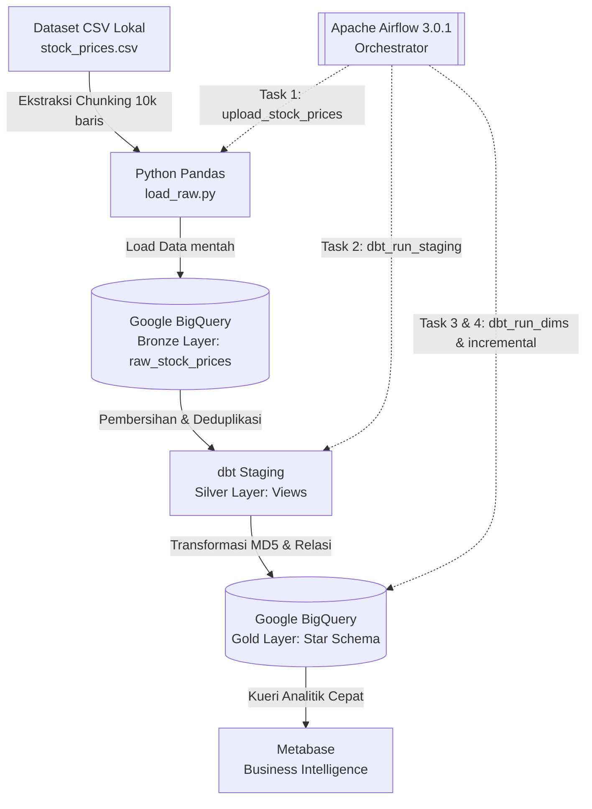

# **Final Project: End-to-End Financial Data Engineering Pipeline**

**Course:** Data Engineering  
**Level:** Undergraduate (3rd Year)  
**Institution:** Universitas Ciputra Surabaya

---

# **1. Project Overview**

Proyek ini merupakan implementasi End-to-End Batch Data Pipeline yang memproses data pasar saham historis menggunakan ekosistem Modern Data Stack.

Infrastruktur dirancang dalam lingkungan terisolasi menggunakan kontainer (Docker), yang mengotomatisasi ekstraksi data mentah, transformasi relasional berbasis Star Schema, hingga penyajian visualisasi analitik interaktif.

---

# **2. System Architecture**



Sistem ini mengadopsi arsitektur Medallion (Bronze, Silver, Gold).

## **a. Ingestion Layer (Bronze Layer)**

### Teknologi

- Python (Pandas)
- Google Cloud BigQuery

### Proses

Skrip `load_raw.py` membaca file CSV lokal dalam potongan 10.000 baris (*chunking*) untuk efisiensi RAM.

Skrip ini dikonfigurasi untuk menjalankan Daily Incremental Load berdasarkan Execution Date dari Airflow.

### Keamanan

Menerapkan logika Idempotency (operasi penghapusan data pada hari-H sebelum penyisipan data baru) untuk mencegah duplikasi apabila terjadi kegagalan sistem.

Data dimuat ke dataset raw di BigQuery.

---

## **b. Transformation Layer (Silver & Gold Layer)**

### Teknologi

- dbt (Data Build Tool)

### Staging (Silver)

Melakukan standardisasi tipe data, pembersihan nama kolom, pengubahan teks menjadi huruf kapital, dan deduplikasi menggunakan Window Function di model `stg_stock_prices`.

### Marts (Gold - Star Schema)

Membangun empat tabel dimensi:

- `dim_stock`
- `dim_sector`
- `dim_industry`
- `dim_date`

menggunakan Surrogate Keys deterministik berbasis fungsi hash `MD5()`.

Tabel fakta (`fact_stock_prices`) memuat kalkulasi metrik seperti perubahan harga harian (*price change percentage*).

### Data Quality

Diimplementasikan pengujian:

- `not_null`
- `unique`

pada Primary Keys melalui konfigurasi YAML.

---

## **c. Orchestration Layer**

### Teknologi

- Apache Airflow 3.0.1

### Proses

Penjadwal terpusat (`master_financial_pipeline`) yang mengatur urutan eksekusi secara berantai:

```text
Ekstraksi Python
      ↓
dbt Staging
      ↓
dbt Dimensions
      ↓
dbt Fact
      ↓
dbt Test
```

---

## **d. Serving & Analytics Layer**

### Teknologi

- Metabase

### Proses

Terhubung langsung ke BigQuery (Marts Layer) untuk menyajikan dashboard analitik tanpa membebani basis data transaksional. Alur ini juga dapat diakses melalui description.html yang sudah di sediakan di dalam folder.

---

# **3. Dataset Description**

Dataset yang digunakan adalah US Stock Market Historical OHLCV.

Dataset ini berisi riwayat pergerakan harga saham dari berbagai perusahaan di bursa efek Amerika Serikat.

Kolom utama meliputi:

- Date
- Open
- High
- Low
- Close
- Adj Close
- Volume

Data diperkaya dengan entitas:

- Sector
- Industry

---

# **4. Local Installation & Execution Guide**

Karena batas ukuran file dan kebijakan keamanan, file kredensial (JSON) dan file data mentah (CSV) tidak disertakan di dalam repositori ini.

Ikuti instruksi berikut secara berurutan untuk menjalankan proyek dari awal.

---

## **Tahap 1: Prasyarat Sistem & Clone Repository**

Pastikan Anda telah menginstal:

- Docker Desktop (dalam status Running)
- Git
- VS Code

### 1. Kloning Repository

Buka terminal dan jalankan:

```bash
git clone https://github.com/EvelynnnKH/DE_ALP.git

cd DE_ALP
```

### 2. Buat File Konfigurasi Environment

Salin file `.env.example` menjadi:

```text
.env
```

---

## **Tahap 2: Konfigurasi Google Cloud Platform (GCP)**

Anda wajib menyediakan Service Account GCP untuk memberikan akses tulis/baca ke BigQuery.

### 1. Membuat Project GCP

- Buka Google Cloud Console.
- Buat Project baru.
- Catat Project ID Anda.

### 2. Mengaktifkan BigQuery API

Buka:

```text
APIs & Services
    └── Library
```

Cari:

```text
BigQuery API
```

Kemudian klik:

```text
Enable
```

### 3. Membuat Service Account

Buka:

```text
IAM & Admin
    └── Service Accounts
```

Klik:

```text
Create Service Account
```

Berikan nama khusus, misalnya:

```text
airflow-bq
```

### 4. Memberikan Hak Akses

Pada bagian:

```text
Grant this service account access to project
```

berikan role:

```text
BigQuery Admin
```

### 5. Membuat Credential JSON

- Buka Service Account yang baru dibuat.
- Masuk ke tab **Keys**.
- Klik **Add Key**.
- Pilih **Create New Key**.
- Pilih format **JSON**.

### 6. Simpan Credential

Ubah nama file yang terunduh menjadi:

```text
service-account.json
```

### 7. Letakkan Credential pada Folder Project

Buat folder:

```text
credentials/
```

Kemudian letakkan file:

```text
service-account.json
```

di dalam folder tersebut.

Struktur direktori:

```text
DE_ALP/
│
├── credentials/
│   └── service-account.json
│
├── ingestion/
├── dbt/
├── dags/
└── docker-compose.yml
```

---

## **Penting - Perubahan Kode**

Anda wajib menyesuaikan Project ID pada kode sumber agar mengarah ke proyek GCP Anda.

Ganti string berikut:

```text
de-final-project-2026
```

dengan Project ID GCP milik Anda pada file:

- `ingestion/load_raw.py` (variabel PROJECT_ID)
- `dbt/sources.yml` (variabel project)
- `dbt/profiles.yml` (variabel project)

---

## **Tahap 3: Mengunduh Dataset**

1. Kunjungi dataset Kaggle:

   **[US Stock Market Historical OHLCV Dataset](https://www.kaggle.com/datasets/asadullahcreative/us-stock-market-historical-ohlcv-dataset)**

2. Unduh (*download*) dan ekstrak dataset tersebut.

3. Ubah nama file utama menjadi:

```text
stock_prices.csv
```

4. Pindahkan file tersebut ke dalam folder:

```text
ingestion/
```

Struktur folder yang diharapkan:

```text
DE_ALP/
│
├── ingestion/
│   └── stock_prices.csv
│
├── credentials/
├── dbt/
└── dags/
```

---

## **Tahap 4: Menyalakan Infrastruktur**

### 1. Menjalankan Docker Compose

Buka terminal pada direktori proyek dan jalankan:

```bash
docker compose up -d
```

### 2. Menunggu Seluruh Service Aktif

Tunggu sekitar 1–2 menit hingga seluruh kontainer berikut berstatus healthy:

- Airflow
- PostgreSQL
- Metabase

---

## **Tahap 5: Eksekusi Pipeline (Airflow)**

### 1. Akses Airflow

Buka browser dan masuk ke:

```text
http://localhost:8081
```

### 2. Login

Gunakan kredensial berikut:

```text
Username: airflow
Password: airflow
```

### 3. Aktifkan DAG

Temukan DAG:

```text
master_financial_pipeline
```

Ubah status dari:

```text
Paused → Unpaused
```

### 4. Trigger DAG

Klik tombol:

```text
Play (Trigger DAG)
```

pada bagian kanan atas.

### 5. Monitoring Eksekusi

Pantau proses pada tab:

```text
Grid
```

Seluruh task harus berstatus:

```text
Success (Hijau)
```

---
## **Tahap 6: Data Quality Testing (dbt)**
### Menjalankan Test

```bash
docker compose exec airflow-scheduler bash
cd dbt
dbt compile
dbt run
dbt test
```

Hasil: `PASS=42 WARN=0 ERROR=0 SKIP=0 TOTAL=42`

## **Tahap 7: Pembuatan Dokumentasi Data (dbt Docs)**

### 1. Buka Terminal Baru

Buka terminal baru pada direktori proyek Anda.

### 2. Generate Dokumentasi dbt

Masuk ke dalam kontainer Airflow dan jalankan:

```bash
# Generate dokumentasi dari dalam container
docker compose exec airflow-scheduler bash -c "cd /opt/airflow/dbt && dbt docs generate"

# Jalankan web server lokal
cd dbt/target
py -m http.server 8000
```

Buka di browser: `http://localhost:8000`

Dokumentasi mencakup lineage graph, deskripsi tiap model dan kolom, serta status test per kolom.

---

## **Tahap 8: Konfigurasi Metabase (Visualisasi)**

### 1. Akses Metabase

Buka browser dan masuk ke:

```text
http://localhost:3001
```

### 2. Registrasi Akun

Selesaikan proses registrasi akun lokal Metabase.

### 3. Hubungkan ke BigQuery

Pada halaman:

```text
Add your data
```

pilih:

```text
Google BigQuery
```

### 4. Upload Credential

Unggah file:

```text
service-account.json
```

dari folder:

```text
credentials/
```

untuk melakukan autentikasi.

### 5. Sinkronisasi Data

Metabase akan memindai Data Warehouse Anda secara otomatis.

---

## **Panduan Pembuatan Chart**

### Chart 1 — Stock Price Trend Over Time

_How have stock prices changed over time, and what overall market trend can be observed?_

```sql
SELECT
    d.full_date,
    AVG(f.close_price) AS avg_close_price
FROM raw.fact_stock_prices f
JOIN raw.dim_date d ON f.date_key = d.date_key
GROUP BY d.full_date
ORDER BY d.full_date;
```

Visualization: **Line Chart**

Insights from Chart
- Are stock prices generally increasing or decreasing?
- Are there periods of significant market downturns or recoveries?
- What is the overall market direction over time?
---

### Chart 2 — Sector Performance Comparison

_Which business sectors have the highest average stock prices?_

```sql
SELECT
    ds.sector,
    ROUND(AVG(f.close_price), 2) AS avg_close_price
FROM raw.fact_stock_prices f
JOIN raw.dim_sector ds ON f.sector_key = ds.sector_key
GROUP BY ds.sector
ORDER BY avg_close_price DESC;
```

Visualization: **Bar Chart**

Insights from Chart
- Which sectors perform better than others?
- Which sectors may offer stronger investment opportunities?
- How do average stock prices vary across sectors?
---

### Chart 3 — Top 10 Stocks by Average Daily Return (%)

_Which stocks generate the highest average daily returns?_

```sql
SELECT
    ds.ticker,
    ROUND(AVG(f.price_change_pct), 2) AS avg_return_pct
FROM raw.fact_stock_prices f
JOIN raw.dim_stock ds ON f.stock_key = ds.stock_key
GROUP BY ds.ticker
ORDER BY avg_return_pct DESC
LIMIT 10;
```

Visualization: **Bar Chart**

Insights from Chart
- Which stocks provide the strongest average returns?
- Which stocks outperform the broader market?
- Which stocks may attract growth-oriented investors?
---

### Chart 4 — Quarterly Trading Volume Trend

_How has trading activity changed over time, and during which periods was trading volume highest?_

```sql
SELECT
    DATE_TRUNC(d.full_date, QUARTER) AS quarter_date,
    SUM(f.volume) AS total_volume
FROM raw.fact_stock_prices f
JOIN raw.dim_date d ON f.date_key = d.date_key
GROUP BY quarter_date
ORDER BY quarter_date;
```

Visualization: **Line Chart**

Insights from Chart
- When was trading activity at its peak?
- Is market participation increasing or decreasing?
- Are there unusual spikes in trading volume?
---

### **Dashboard Utama**

Simpan keempat chart tersebut ke dalam satu Dashboard utama.


### Insights dari Dashboard
- Tren rata-rata harga penutupan dari 2020–2026. Harga tumbuh konsisten dari ~$100 ke ~$250.
- Perbandingan rata-rata harga saham antar sektor. Healthcare ($247.28) memimpin, diikuti Financial Services ($197.98) dan Industrials ($194.14).
- AAPL, CARR, dan NVDA secara konsisten mencatatkan return harian rata-rata tertinggi (~0.08–0.10%).
- Volume perdagangan memuncak di Q1 2021 (~160 miliar) lalu menurun bertahap hingga 2026.
---

# **5. Expected Output**

Sistem dinyatakan berhasil dieksekusi apabila memenuhi kriteria berikut.

## **Airflow**

Grafik eksekusi DAG menampilkan status:

```text
Success
```

pada seluruh tugas secara berurutan.

## **BigQuery**

Tabel berikut berhasil terbentuk tanpa redundansi data:

```text
raw_stock_prices
dim_stock
dim_sector
dim_industry
dim_date
fact_stock_prices
```

## **Metabase**

Dashboard berhasil melakukan kalkulasi analitik dan menampilkan visualisasi grafik interaktif.

---

# **6. Findings & Conclusion**

Implementasi End-to-End Pipeline ini membuktikan efektivitas pemodelan Star Schema dalam mempercepat kueri analitik pada basis data berorientasi kolom seperti BigQuery.

Penerapan Surrogate Keys menggunakan fungsi `MD5()` memastikan integritas relasi tabel fakta dan tabel dimensi tetap terjamin secara deterministik.

Berdasarkan visualisasi data yang dihasilkan, sektor Technology secara konsisten mendominasi pergerakan volume perdagangan harian dibandingkan sektor lainnya.

---

# **7. Known Limitations**

## **1. BigQuery DML Restrictions**

Pada konfigurasi versi Free Tier (Sandbox) GCP, operasi:

```sql
MERGE
```

(DML) dilarang.

Sebagai penyesuaian, model fakta dalam proyek ini diatur menggunakan materialisasi:

```text
table (Full Refresh)
```

meskipun logika kueri incremental telah dirancang dan disertakan di dalam struktur kodenya.

---

## **2. Ketergantungan File Lokal**

Arsitektur ingestion saat ini mengandalkan ketersediaan file CSV secara statis.

Skalabilitas masa depan dapat dicapai dengan mengintegrasikan konektor API real-time seperti:

- Yahoo Finance
- Alpha Vantage
